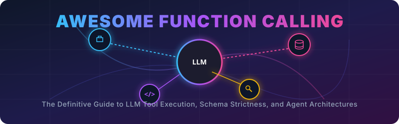

  

  
  
  
  

# 🚀 Awesome Function Calling

## 💡 Function-Calling & Tool Use Variants in Large Language Models (LLMs)

Function-calling (or tool use) enables Large Language Models (LLMs) to interact seamlessly with external systems, APIs, and databases, forming the core of modern autonomous AI agents. Depending on the runtime architecture, schema strictness requirements, and complexity of execution, function-calling is implemented through several distinct paradigms.

This curated list breaks down the primary function-calling variations, their enforcement strictness, developer-configured options, and integration ecosystems.

---

## ⚙️ [1. Execution & Complexity Variants](details/execution_complexity.md)

These variants define how many functions are processed and how they execute to complete a user query.

| Variant | Description | Year | Paper / Reference |
| :--- | :--- | :---: | :--- |
| **Single Function Calling** | The model processes a prompt to invoke exactly one function from a single tool definition. | 2023 | [Toolformer: Language Models Can Teach Themselves to Use Tools](https://arxiv.org/abs/2302.04761) |
| **Multiple Function Selection** | The LLM is provided with a toolbox of several distinct functions and analyzes user intent to select the single best tool for the task. | 2022 | [MRKL Systems: A modular, neuro-symbolic architecture that combines large language models, external knowledge sources and discrete reasoning](https://arxiv.org/abs/2205.00445) |
| **Parallel Function Calling** | The model calls a single function multiple times simultaneously within one response payload.  *Example:* Checking the weather for three different cities at once. | 2023 | [An LLM Compiler for Parallel Function Calling](https://arxiv.org/abs/2312.04511) |
| **Parallel Multiple Function Calling** | An advanced variant where the LLM triggers multiple *different* tools concurrently. | 2023 | [An LLM Compiler for Parallel Function Calling](https://arxiv.org/abs/2312.04511) |
| **Multi-Step / Chaining Function Calling** | The LLM executes a sequential, dependent loop. It generates an initial tool call, digests the system return payload, and uses that new data to trigger a subsequent tool call. | 2022 | [ReAct: Synergizing Reasoning and Acting in Language Models](https://arxiv.org/abs/2210.03629) |

---

## 🔒 [2. Schema Enforcement & Strictness Variants](details/schema_strictness.md)

These variations dictate how rigidly the LLM must adhere to the formatting rules of the underlying APIs.

| Variant | Description | Year | Paper / Reference |
| :--- | :--- | :---: | :--- |
| **Standard Function Calling (Tool Use)** | The model receives a structural JSON schema detailing arguments and types. It attempts to return matched arguments but may occasionally hallucinate or omit fields. | 2023 | [Gorilla: Large Language Model Connected with APIs](https://arxiv.org/abs/2305.15334) |
| **Structured Outputs** | Introduced as a highly strict variant by provider APIs. Employs constrained decoding techniques to guarantee that the model's output strictly matches the specified JSON schema. | 2023 | [Efficient Guided Generation for Large Language Models](https://arxiv.org/abs/2307.09702) |
| **JSON Mode** | A lightweight precursor where no specific API schema is enforced. The model is mathematically forced to respond only in a valid, parseable JSON format. | 2023 | [Efficient Guided Generation for Large Language Models](https://arxiv.org/abs/2307.09702) |

---

## 🎯 [3. Model Behavior Options (Tool Choice)](details/model_behavior.md)

Developers can explicitly constrain how the LLM decides to interact with functions via system configurations:

| Mode / Option | Description | Year | Paper / Reference |
| :--- | :--- | :---: | :--- |
| **Auto Mode** | The default behavior where the model dynamically decides whether to reply with standard text or issue tool calls. | 2023 | [Gorilla: Large Language Model Connected with APIs](https://arxiv.org/abs/2305.15334) |
| **Required Mode** | Forces the LLM to select and call at least one of the available tools before responding. | 2024 | [The Berkeley Function Calling Leaderboard (BFCL)](https://proceedings.mlr.press/v267/patil25a.html) |
| **Forced / Specific Function** | Restricts the model entirely, forcing it to call one specific function regardless of the prompt nuance. | 2023 | [Gorilla: Large Language Model Connected with APIs](https://arxiv.org/abs/2305.15334) |

---

## 🌐 [4. Integration Ecosystem Variants](details/integration_ecosystem.md)

| Variant | Description | Year | Paper / Reference |
| :--- | :--- | :---: | :--- |
| **Custom / Injected Tooling** | Used for local, open-source models that lack native function-calling layers. Tool docstrings are converted to JSON and injected into system prompts, paired with code parsers to extract the calls. | 2022 | [ReAct: Synergizing Reasoning and Acting in Language Models](https://arxiv.org/abs/2210.03629) |
| **Model Context Protocol (MCP)** | An infrastructure layer that standardizes tool discovery and authentication. Serves as a unified middle-layer connecting models instantly to applications without rewriting unique JSON schemas for every model type. | 2024 | [Model Context Protocol Specification](https://modelcontextprotocol.io/) |

##  Star History

<a href="https://www.star-history.com/?repos=ishandutta2007%2FAwesome-Function-Calling&type=date&legend=bottom-right">
<picture>
<source media="(prefers-color-scheme: dark)" srcset="https://api.star-history.com/chart?repos=ishandutta2007/Awesome-Function-Calling&type=date&theme=dark&legend=bottom-right" />
<source media="(prefers-color-scheme: light)" srcset="https://api.star-history.com/chart?repos=ishandutta2007/Awesome-Function-Calling&type=date&legend=bottom-right" />

</picture>
</a>

