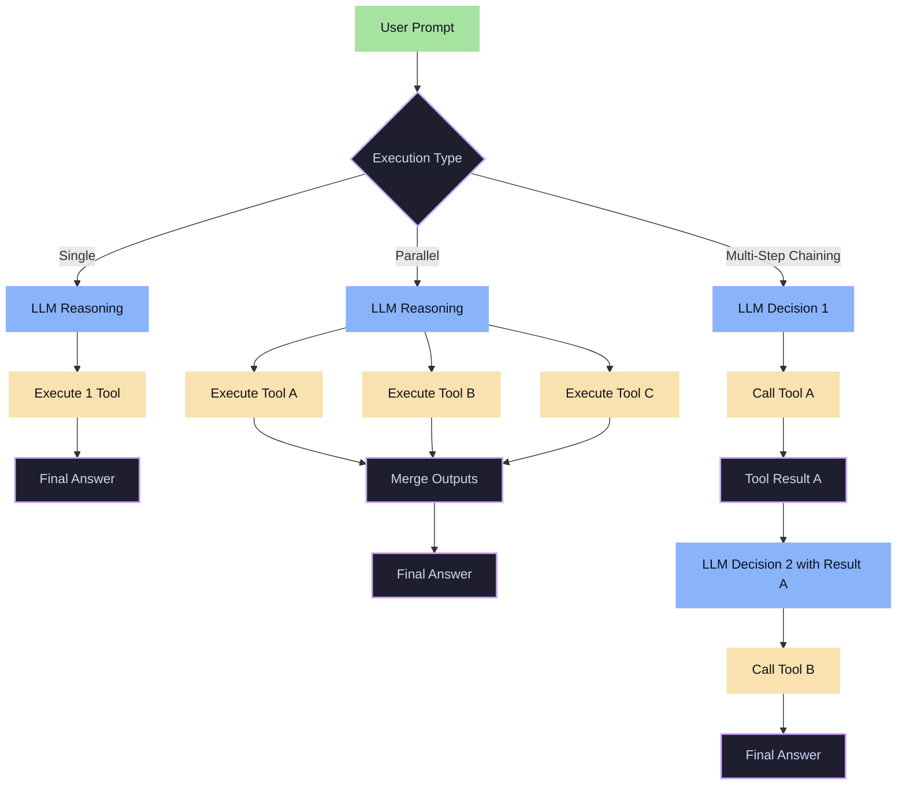

# Execution & Complexity Variants in Function Calling

This document provides a detailed breakdown of the execution and complexity variants used when Large Language Models (LLMs) interact with external tools and APIs.

---

## Architecture Overview

Here is a visual representation of how execution flows differ between Single/Parallel tool calling and Multi-Step Chaining:

---

## Detailed Variant Explanations

### 1. Single Function Calling
In this variant, the model processes the user's input and selects exactly one function to invoke. This is the simplest form of tool use and is suitable for clear, singular tasks like querying a database for a specific record.

### 2. Multiple Function Selection
The model is provided with a toolbox of several distinct functions (e.g., `get_weather`, `send_email`, `calculate_sum`). The model must analyze the intent of the prompt and decide which one of the available functions is best suited to fulfill the user's request.

### 3. Parallel Function Calling
Parallel function calling allows the LLM to call a single function multiple times concurrently in a single turn. For instance, if a user asks: *"What is the weather in Paris, Tokyo, and New York?"*, the model generates three tool call requests (one for each city) simultaneously.

### 4. Parallel Multiple Function Calling
An advanced extension of parallel function calling where the LLM triggers multiple *different* functions at the same time. For example, checking a user's calendar (`get_calendar_events`) and retrieving the current time (`get_current_time`) in a single model turn.

### 5. Multi-Step / Chaining Function Calling
This follows the **ReAct (Reasoning and Acting)** framework loop. The model:
1. Analyzes the prompt and generates a tool call.
2. Waits for the execution environment to return the tool result.
3. Uses the tool's result to perform another round of reasoning.
4. Generates a subsequent tool call (or outputs the final answer).
This loop continues until the task is fully resolved.
