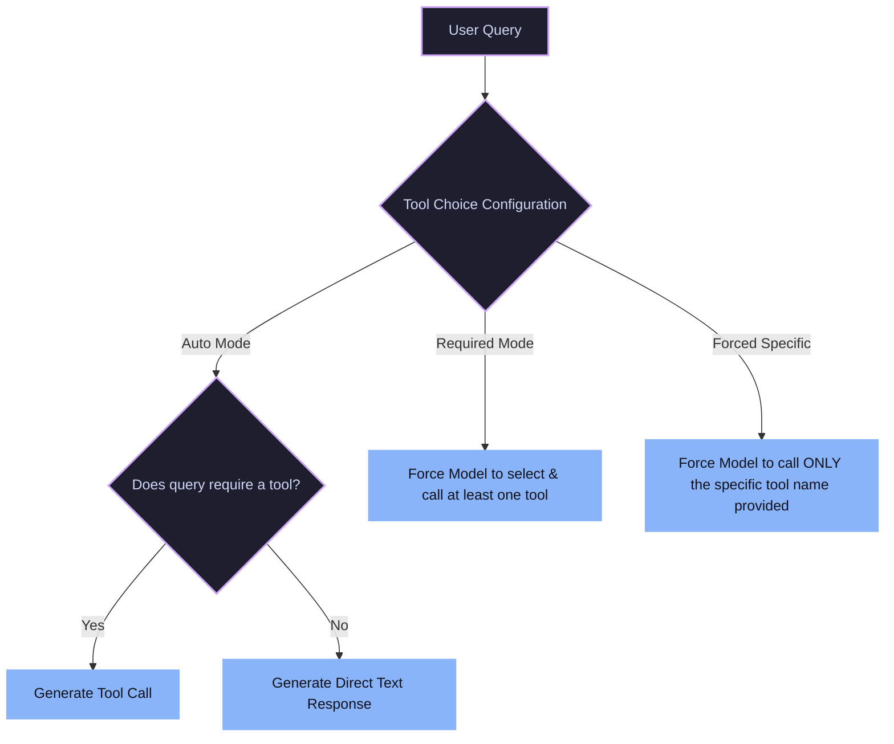

# Model Behavior Options (Tool Choice)

This document explains how developers configure and constrain an LLM's decision-making process when determining whether or not to use tools.

---

## Tool Choice Decision Flow

The diagram below highlights the model's decision path for each tool choice mode:

---

## Detailed Explanations of Modes

### 1. Auto Mode
This is the default configuration. The LLM receives the user's prompt alongside a list of tool definitions. It has the autonomy to decide whether a tool is necessary. If the user asks a conversational question, the model responds directly in text. If the user asks a question requiring external data (e.g., weather or time), it generates a tool call.

### 2. Required Mode
In Required Mode (`tool_choice: "required"` or `tool_choice: "any"`), the model is strictly forced to select and call at least one tool from the toolbox. It cannot choose to respond with plain text first. This is highly useful in agent loops where a tool call is mandatory to progress the state.

### 3. Forced / Specific Function
Forced mode restricts the model entirely to a single tool specified by the developer (e.g., `tool_choice: {"type": "function", "function": {"name": "my_specific_function"}}`). The model must invoke this specific function, and is restricted from calling any other functions or generating standard conversational text.
