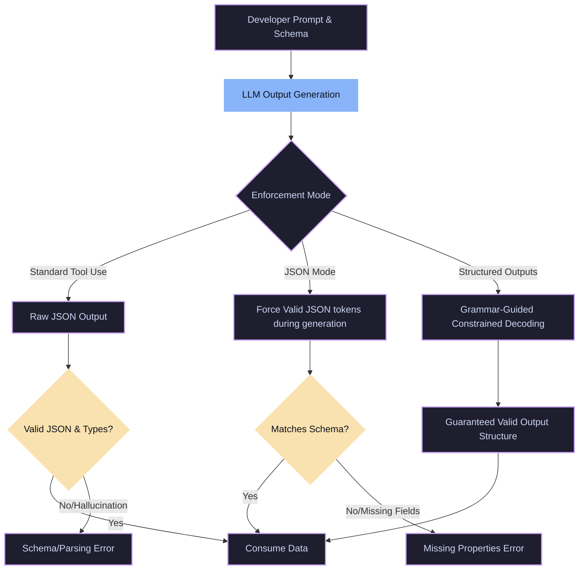

# Schema Enforcement & Strictness Variants

This document provides a detailed explanation of schema enforcement methods used to guarantee structured responses from LLMs.

---

## Validation Flow

The diagram below illustrates how structured outputs and JSON modes validate and restrict output generation compared to standard tool calling:

---

## Detailed Schema Variants

### 1. Standard Function Calling (Tool Use)
In standard function calling, the developer supplies the LLM with a structural JSON schema outlining the parameters and types of the tools. The model tries to generate an output that matches this schema via prompt instructions. However, because there is no programmatic constraint on the tokens generated, the model can occasionally hallucinate incorrect types, omit required properties, or produce malformed JSON.

### 2. Structured Outputs
Introduced by modern LLM APIs (e.g., OpenAI's Structured Outputs), this variant uses **grammar-guided constrained decoding** at the inference engine level. It translates the developer's JSON schema into a grammar (like Context-Free Grammars). The engine restricts the logits at each step, making it mathematically impossible for the model to output a token that violates the JSON schema. It guarantees 100% schema adherence.

### 3. JSON Mode
A predecessor to Structured Outputs. In JSON Mode, the inference engine forces the model to respond in a valid, parseable JSON format. However, unlike Structured Outputs, the model is not forced to adhere to any *specific* schema. It ensures the syntax is correct (`{}` and parsing works), but it does not guarantee that the required fields or correct property names are present in the response.
